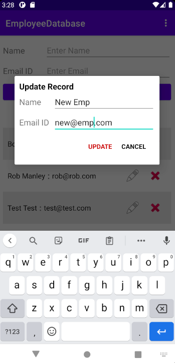

 <h1 align="center">Employee Database</h1>

  

## About The Project

This is a mobile application that functions as a basic employee database. It lists the names and emails of each employee in the table. It was created using Android Studio, Kotlin, and SQLite.

 

## Usage
The basic functionality of the website is as follows:

* The user launches the program using an Android Emulator.
* The program automatically displays all of the employees in the list.

* From here the user can type in a new employee name and email in the respective text boxes. Clicking the Add Employee button will add the employee to the list and refresh the displayed employees list.

* The employee can also edit and delete the employees currently shown under the Current Employees section of the page.

* Clicking the edit (pencil) button in one of the employee entries brings up a dialog box where the updated name and email can be put. Clicking the UPDATE button will update the respective employee's information accordingly.

* Clicking the delete (red x) button in one of the employee entries brings up an alert asking if the user is sure that they want to delete the respective employee. Clicking Yes will delete the employee from the list and refresh the employees shown in the Current Employees section of the page.

 

## File Structure

The primary files used in this application are located in the following path within this repository: <i>app/src/main</i>

The Kotlin class files in the <i>java/com/example/employeedatabase</i> path in the <i>main</i> folder are as follows: EmployeeModel.kt, DatabaseHandler.kt, ItemAdapter.kt, MainActivity.kt
* The EmployeeModel class contains the Data Model class which provides the template for each employee in the database.
* The DatabaseHandler class is used for handling the database logic and extending the SQliteOpenHelper base class, which is used for connecting and interacting with the SQlite database used in this program.
* The ItemAdapter class creates the view holder for view items, connects the data source of the RecyclerView and handles the view logic by creating a RecyclerView Adapter.
* The MainActivity class acts as the controller for the UI. It contains all of the functions associated to each part of the UI and bridges the UI and database together.

The XML files in the <i>res/layout</i> path of the <i>main</i> folder are as follows: content_main.xml, activity_main, item_row.xml, dialog_update.xml
* The content_main file is used for main content of the page, so where the user can input text and add employees, as well as initializing the RecyclerView which will display all of the employees in the database.
* The activity_main file is used as part of the tools layout for the content_main file.
* The item_row file is used for providing the template for each employee that will be displayed from the database. In other words, it provides the template for each item in the RecyclerView.
* The dialog_update file is used for providing the window that is shows when the user attempts to edit an employee's information. You can edit their name and email.

 

## Prerequisites
Gradle must be installed for the application to run correctly. 

 

## Resources Used

This project was based off of the following tutorial: https://tutorials.eu/android-sqlite-database-in-depth-guide/
